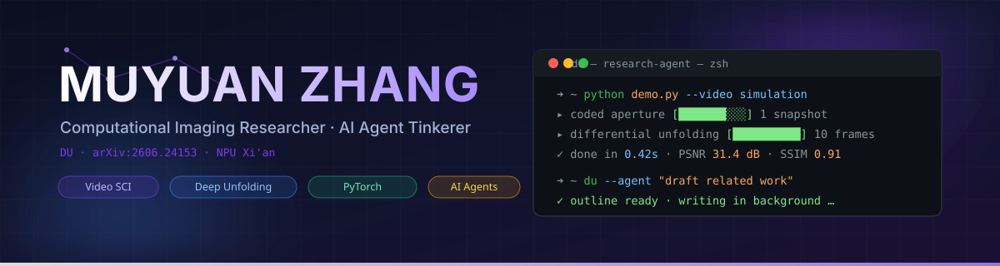

  

  

---

### 👋 Hey, I'm Muyuan Zhang

Computational imaging researcher at **Northwestern Polytechnical University (NPU)**, Xi'an. I build efficient **deep unfolding** networks that recover *videos from a single coded snapshot* — and I'm equally obsessed with **AI coding agents** that write code while I sleep.

- 🔭 **Research** — video snapshot compressive imaging, deep unfolding, video super-resolution
- 🤖 **Agent stack** — DeepSeek Harness · Qwen Code · Claude Code · Codex · ECC · superpowers · gstack
- 🛠️ **Building** — [DU](https://github.com/Muyuan-Zhang/DU) · [PaintedTales](https://github.com/Muyuan-Zhang/PaintedTales) · [cheatsheets](https://github.com/Muyuan-Zhang/cheatsheets)
- 📄 **Paper** — *Differential Unfolding (DU)* · [arXiv:2606.24153](https://arxiv.org/pdf/2606.24153)

---

### 🧪 Research

  
  
  
  

> **Differential Unfolding (DU)** — *Efficient Unfolding Reconstruction for Video Snapshot Compressive Imaging*.
> Recover dozens of high-fidelity video frames from a **single coded 2D snapshot**, with a differential deep-unfolding framework. Official PyTorch implementation with pretrained weights.

📡 Research radar — repos I fork & follow closely

| Repo | Why it's on my radar |
|---|---|
| [DOVE](https://github.com/Muyuan-Zhang/DOVE) | NeurIPS'25 — efficient one-step diffusion for **real-world video super-resolution** |
| [DMP-DUN](https://github.com/Muyuan-Zhang/DMP-DUN) | Diffusion priors inside **deep unfolding** for image compressive sensing |
| [AutoResearchClaw](https://github.com/Muyuan-Zhang/AutoResearchClaw) | Fully autonomous research: from idea to paper 🦞 |
| [Auto-claude-code-research-in-sleep](https://github.com/Muyuan-Zhang/Auto-claude-code-research-in-sleep) | Markdown-only skills for autonomous ML research & experiment automation |
| [autoresearch](https://github.com/Muyuan-Zhang/autoresearch) | AI agents driving single-GPU nanochat training |

---

### 🗂️ Featured Projects

  
  
  

---

### 🛠️ Tech Stack

  

**Everyday agent toolkit** — because writing code by hand is so 2023:

  
  
  
  
  
  
  
  

---

### 📊 GitHub Stats

  
  
  

  

---

### 📫 Connect

  
  
  
  

  

---

  <i>“Everything is a plugin.”</i> — DeepSeek Harness philosophy, adopted wholeheartedly ⭐️

